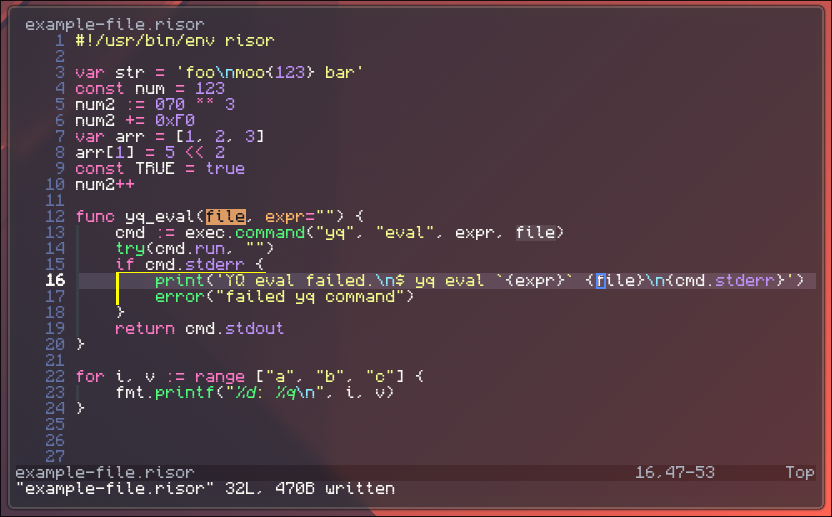

# tree-sitter-risor

[Tree-sitter](https://github.com/tree-sitter/tree-sitter)
grammar for the [Risor](https://risor.io/) scripting language.

## Installing

> [!IMPORTANT]
> This grammar is still work in progress! Once it has matured a bit, then
> I will start poking tree-sitter plugin maintainers so it can get added
> to various editors.

To install locally for Neovim, follow this guide:
<https://github.com/nvim-treesitter/nvim-treesitter#adding-parsers>

## License

This repository is licensed under the MIT license.

Heavily inspired by the tree-sitter grammar for Go: <https://github.com/tree-sitter/tree-sitter-go>
